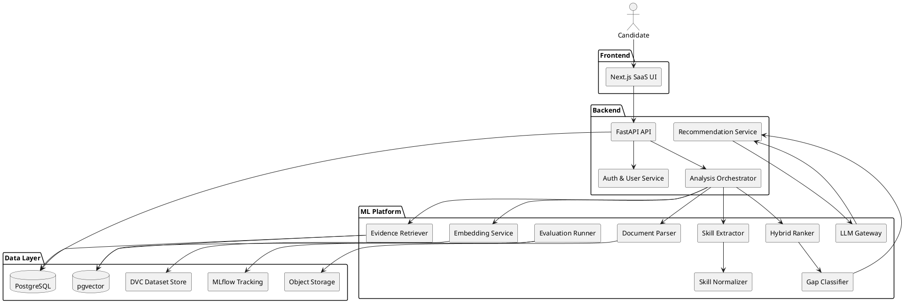
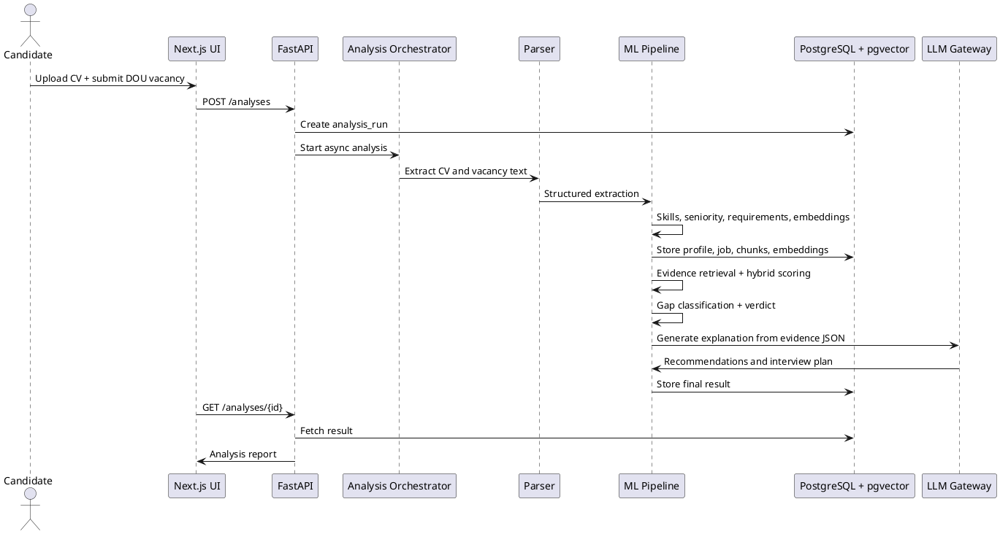
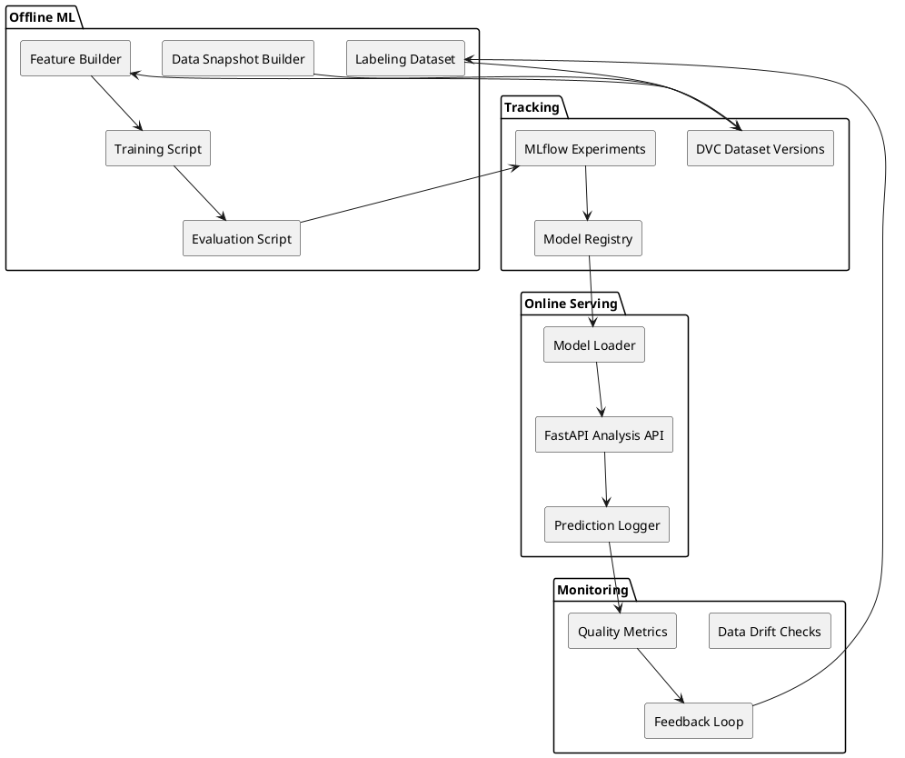

# SPEC-1-DOU Job Search Copilot

## Background

Ukrainian IT candidates often approach job search in a fragmented and low-signal way: they reuse the same CV across many vacancies, apply to roles without understanding fit, and prepare for interviews generically rather than for a specific company, domain, or technical stack.

This creates a practical problem: even capable junior and junior+ candidates may receive few replies because their real experience is not clearly mapped to the expectations of a given vacancy. Their CV may contain relevant projects, transferable backend/API experience, or product-oriented signals, but those signals are often weakly positioned or hidden behind generic wording.

The proposed system, **DOU Job Search Copilot**, addresses this by analyzing a candidate CV together with DOU job vacancies and, later, company profiles. Instead of producing only a single resume-to-job match score, the system builds an evidence-based job search plan. It explains which vacancies are worth applying to, which ones require CV tailoring first, which gaps are realistic to close, and how the candidate should prepare for interviews.

The core product idea is a **ML-powered career copilot for the Ukrainian IT market**. The ML/NLP layer performs structured parsing, skill extraction, semantic matching, requirement-to-evidence mapping, gap classification, and opportunity ranking. The LLM layer is used as an explanatory and writing assistant: it can rewrite summaries, suggest honest CV improvements, generate cover-message angles, and produce interview preparation plans.

For the MVP, the system should prioritize correctness, explainability, and honest recommendations over broad automation. The first version can work with a manually uploaded CV and pasted DOU vacancy text or URL. Full-scale DOU vacancy ingestion, company profile crawling, job search dashboards, and historical tracking can be deferred to later versions.

## Requirements

### Assumptions

- Product direction: large ML/AI project with a SaaS interface, not a simple LLM wrapper and not only a portfolio demo.
- Initial market: Ukrainian IT candidates using DOU as one of the main job discovery sources.
- Initial user segment: junior, trainee, junior+, and early middle candidates who need help deciding where to apply and how to position their CV.
- MVP strategy: start with one CV and one vacancy in the user flow, but internally build reusable ML datasets, feature extraction, ranking, evaluation, and experiment tracking so the project demonstrates real ML depth.
- ML strategy: combine deterministic NLP, embedding models, supervised/weakly supervised ranking, gap classification, explainability, and LLM-generated natural-language recommendations.
- Data ingestion strategy: support pasted vacancy text and vacancy URL first; automated large-scale vacancy discovery should be added only after legal, ethical, and technical constraints are reviewed.

### Must Have

- User can create a candidate profile by uploading or pasting a CV.
- System extracts structured candidate data: target role, seniority estimate, skills, projects, experience signals, weak signals, and positioning.
- User can submit a DOU vacancy by URL or pasted text.
- System extracts structured vacancy data: title, company, required skills, preferred skills, responsibilities, seniority, domain, language expectations, and work format.
- System calculates a hybrid match result using separate components instead of a single opaque score:
  - skill match
  - semantic match
  - experience evidence
  - seniority fit
  - domain/company fit
  - interview readiness
- System creates an evidence map from vacancy requirements to CV evidence.
- System classifies gaps into critical gaps, soft gaps, keyword gaps, learning gaps, and fake-risk gaps.
- System produces a practical verdict for the vacancy:
  - Apply now
  - Tailor first
  - Realistic stretch
  - Learning target
  - Skip
- System suggests honest CV improvements without inventing experience.
- System generates a vacancy-specific interview preparation plan.
- System stores candidate profiles, analyzed vacancies, match results, evidence maps, gap reports, and generated recommendations.
- System exposes results through a web UI suitable for repeated use by the same candidate.

### Should Have

- User can compare multiple analyzed vacancies in a dashboard.
- System can rank a batch of vacancies for one candidate once several vacancies are ingested.
- System can detect repeated gaps across analyzed vacancies.
- System can generate a short cover-message angle for each vacancy.
- System can maintain a history of user applications and statuses.
- System can support Ukrainian, Russian, and English CV/vacancy content.
- System can separate deterministic ML/ranking logic from LLM-generated explanations.
- Admin can review extraction quality, failed parses, and suspicious recommendations.

### Could Have

- Automated DOU vacancy search by role, seniority, city, remote status, and keyword.
- Company profile analysis based on public company pages, repeated vacancy patterns, tone, tech stack, and domain.
- Weekly job search action plan.
- A/B comparison of different CV versions.
- Exportable tailored CV suggestions and interview battlecards.
- Email or Telegram notifications for newly relevant vacancies.
- Integration with other Ukrainian/European job sources after DOU MVP validation.

### Won't Have in MVP

- Fully automated application submission.
- Claims that guarantee interviews or offers.
- Fake experience generation or misleading CV rewriting.
- Large-scale scraping without legal and technical review.
- Recruiter-side marketplace features.
- Payment/subscription mechanics before product value is validated.
- Blind fine-tuning without an evaluation dataset, baseline metrics, and measurable improvement over simpler retrieval/ranking baselines.

## Method

### Method Summary

The system should be designed as an ML-first career intelligence platform with a SaaS interface. The web product gives the user a simple workflow: upload CV, submit a DOU vacancy, receive fit analysis, CV actions, and interview preparation. Internally, however, the system is built as a reusable ML pipeline for document parsing, skill normalization, semantic retrieval, ranking, gap classification, explainability, and model evaluation.

The MVP should not depend on fine-tuning from day one. Instead, it should establish strong baselines, collect labeled data, track experiments, and only introduce supervised or fine-tuned models where they improve measured metrics.

### Recommended Technical Stack

| Area | MVP Choice | Reason |
|---|---|---|
| Frontend | Next.js, React, TypeScript, Tailwind | SaaS UI, dashboard, candidate workspace |
| Backend API | Python, FastAPI, Pydantic v2 | Typed API contracts, async support, ML-friendly Python ecosystem |
| ML/NLP | scikit-learn, sentence-transformers, spaCy, custom rules | Strong baseline stack for extraction, classification, embeddings, and ranking features |
| Ranking | Weighted hybrid model first; later LightGBM LGBMRanker or another learning-to-rank model | Allows baseline comparison before supervised ranking |
| Database | PostgreSQL | Main transactional store |
| Vector Search | pgvector extension in PostgreSQL | Store embeddings next to business data for MVP simplicity |
| Async Jobs | Celery/RQ/Arq or Prefect workers | Run parsing, embedding, ranking, and batch evaluation outside request/response path |
| Experiment Tracking | MLflow | Track model versions, metrics, parameters, artifacts |
| Dataset Versioning | DVC | Reproducible ML datasets and labeling snapshots |
| Monitoring | Evidently or custom metrics tables first | Track drift, extraction quality, ranking behavior, and LLM hallucination risk |
| Object Storage | S3-compatible storage or local MinIO for dev | Store uploaded CVs, parsed text, raw vacancy snapshots, model artifacts |
| LLM Layer | OpenAI API or local LLM behind an internal LLM gateway | Generate explanations and rewriting suggestions only from structured evidence |

### High-Level Architecture



### Runtime User Flow



### Core ML Pipeline

```text
CV / vacancy input
→ raw document storage
→ text extraction
→ section detection
→ entity and skill extraction
→ skill normalization
→ seniority and domain classification
→ document chunking
→ embedding generation
→ requirement-to-evidence retrieval
→ feature engineering
→ hybrid scoring / ranking
→ gap classification
→ opportunity verdict
→ LLM-grounded recommendations
→ user feedback capture
→ evaluation dataset update
```

### Data Ingestion Strategy

MVP ingestion should support:

1. CV upload or pasted CV text.
2. DOU vacancy URL or pasted vacancy text.
3. Manual company name extraction from vacancy text.
4. Raw document snapshot storage for reproducibility.

Later ingestion should support:

1. Role-based DOU vacancy discovery.
2. Periodic vacancy refresh.
3. Company profile extraction.
4. Duplicate vacancy detection.
5. Expired vacancy detection.

Large-scale automated ingestion must be implemented only after checking robots.txt, DOU terms, rate limits, and legal/ethical constraints.

### Document Parsing

The parser should convert raw user and vacancy inputs into a normalized internal document format.

```json
{
  "document_id": "uuid",
  "document_type": "resume | vacancy | company_profile",
  "language": "en | uk | ru | mixed",
  "raw_text": "...",
  "sections": [
    {
      "section_type": "experience | skills | projects | education | requirements | responsibilities",
      "text": "...",
      "start_char": 0,
      "end_char": 240
    }
  ],
  "source_url": "https://jobs.dou.ua/...",
  "created_at": "timestamp"
}
```

MVP parsing approach:

- Use deterministic text extraction for uploaded files.
- Detect common CV sections with regex and heuristic patterns.
- Detect vacancy sections such as requirements, responsibilities, nice-to-have, benefits, English level, and work format.
- Use language detection because Ukrainian IT content often mixes English technology names with Ukrainian or Russian descriptions.
- Store both raw text and structured parse output so extraction bugs can be debugged later.

### Skill Taxonomy and Normalization

A major ML-project component is the skill taxonomy. The system should not treat `Postgres`, `PostgreSQL`, `psql`, and `SQL database` as unrelated terms.

Skill taxonomy entity:

```json
{
  "skill_id": "uuid",
  "canonical_name": "PostgreSQL",
  "category": "database",
  "aliases": ["postgres", "postgresql", "psql"],
  "related_skills": ["SQL", "relational databases", "indexes"],
  "seniority_weight": 0.7,
  "is_tool": true
}
```

Normalization algorithm:

```text
for each extracted mention:
  1. lowercase and normalize punctuation
  2. exact match against alias table
  3. fuzzy match against alias table
  4. embedding similarity against canonical skill descriptions
  5. assign canonical skill_id and confidence
  6. if confidence is low, store as unresolved_skill_mention for review
```

This creates an ML/data asset that improves over time as users, admin reviews, and evaluation labels add new aliases.

### Candidate Profile Extraction

The candidate profile is the central representation used by ranking and recommendations.

```json
{
  "candidate_id": "uuid",
  "target_role": "Junior Python Backend Developer",
  "estimated_seniority": "junior",
  "skills": [
    {
      "skill": "Python",
      "evidence_level": "strong",
      "source": "skills_section + project_bullet",
      "confidence": 0.92
    }
  ],
  "projects": [
    {
      "title": "Job Matching API",
      "skills": ["Python", "FastAPI", "PostgreSQL"],
      "evidence_chunks": ["..."]
    }
  ],
  "strong_signals": ["REST API development", "PostgreSQL-backed project"],
  "weak_signals": ["commercial experience unclear", "cloud experience not proven"],
  "positioning": "product-minded junior Python backend developer"
}
```

Extraction model stages:

1. Rule-based extraction for explicit skills.
2. spaCy-based tokenization and entity patterns for technologies, companies, dates, and role names.
3. Embedding-based semantic grouping for project descriptions and responsibilities.
4. Seniority classifier using features such as years of experience, role titles, project complexity, commercial experience mentions, and education/certification signals.
5. Optional LLM structured extraction fallback for ambiguous documents, but the LLM output must be validated by Pydantic schemas.

### Vacancy Profile Extraction

Vacancy profile:

```json
{
  "job_id": "uuid",
  "title": "Junior Python Developer",
  "company": "Company X",
  "required_skills": ["Python", "Django", "PostgreSQL", "REST API"],
  "preferred_skills": ["Docker", "AWS", "English"],
  "responsibilities": ["Develop backend services", "Write tests"],
  "seniority": "junior",
  "domain": "fintech",
  "work_format": "remote | hybrid | office | unknown",
  "language_requirements": ["English intermediate"],
  "raw_requirements": [
    {
      "text": "Experience with Django REST Framework",
      "requirement_type": "technical_skill",
      "priority": "required"
    }
  ]
}
```

Vacancy extraction should classify each requirement by:

- technical skill
- seniority / years of experience
- domain knowledge
- responsibility
- soft skill
- language requirement
- work format requirement
- education/certification requirement

This enables more precise gap classification later.

### Company Profile Extraction

Company profile analysis is not required for the first MVP screen, but the schema should support it from the beginning.

```json
{
  "company_id": "uuid",
  "name": "Company X",
  "company_type": "product | outsourcing | outstaffing | startup | unknown",
  "industry": "fintech",
  "observed_tech_stack": ["Python", "Django", "PostgreSQL", "AWS"],
  "hiring_signals": ["ownership", "communication", "product thinking"],
  "interview_signals": ["SQL", "REST API", "Django basics"],
  "confidence": 0.74
}
```

The company profile should be inferred from repeated public signals: company page, vacancy text, repeated technology patterns, domain descriptions, and tone of hiring requirements.

### Embedding and Retrieval Design

The system should embed multiple granularities instead of embedding the whole CV and whole vacancy as one vector.

Candidate embedding units:

- full CV summary
- skills section
- each project
- each experience bullet
- each education/certification block

Vacancy embedding units:

- full vacancy summary
- each hard requirement
- each preferred requirement
- each responsibility
- company/domain description

Evidence retrieval algorithm:

```text
for each job requirement:
  1. create requirement embedding
  2. retrieve top-k candidate chunks from pgvector
  3. filter by skill taxonomy overlap and seniority constraints
  4. rerank candidate chunks with cross-encoder or semantic similarity
  5. classify evidence as direct, transferable, weak, or missing
  6. store requirement → evidence mapping with confidence
```

Evidence map output:

```json
{
  "requirement": "Django REST Framework",
  "evidence": [
    {
      "chunk": "Built FastAPI backend with REST endpoints and PostgreSQL storage",
      "evidence_type": "transferable",
      "confidence": 0.71,
      "reason": "FastAPI REST backend experience partially transfers to DRF backend API work"
    }
  ],
  "final_evidence_level": "soft_gap"
}
```

### Feature Engineering

For each `(candidate, job)` pair, generate a feature vector.

Core features:

```text
skill_match_required_ratio
skill_match_preferred_ratio
weighted_skill_match_score
embedding_similarity_full_cv_to_job
embedding_similarity_projects_to_responsibilities
direct_evidence_ratio
transferable_evidence_ratio
missing_required_skill_count
critical_gap_count
soft_gap_count
keyword_gap_count
learning_gap_count
fake_risk_gap_count
seniority_distance
years_experience_gap
domain_similarity_score
work_format_match
language_requirement_match
interview_readiness_score
cv_tailoring_effort_score
```

These features should be stored because they are needed for debugging, supervised learning, and offline evaluation.

### Hybrid Match Scoring

The MVP ranking model should be interpretable and easy to debug.

```text
overall_score =
  0.22 * skill_match_score
+ 0.18 * semantic_match_score
+ 0.20 * experience_evidence_score
+ 0.15 * seniority_match_score
+ 0.10 * company_domain_score
+ 0.10 * gap_severity_score
+ 0.05 * interview_readiness_score
```

Where:

```text
skill_match_score = weighted overlap between normalized candidate skills and required/preferred skills
semantic_match_score = similarity between vacancy requirements and candidate project/experience chunks
experience_evidence_score = direct + transferable evidence quality
seniority_match_score = penalty-based seniority compatibility
company_domain_score = similarity between candidate experience/projects and company domain
 gap_severity_score = penalty from critical/fake-risk gaps and missing must-have requirements
interview_readiness_score = estimated ability to explain required topics based on CV evidence
```

The weights are initial heuristic weights, not final truth. They should be tuned using labeled ranking data.

### Gap Classification

Gap classifier input:

- requirement text
- requirement type
- requirement priority
- normalized skill
- evidence type
- evidence confidence
- seniority distance
- candidate project evidence
- candidate claimed skills

Gap types:

| Gap Type | Meaning | Example |
|---|---|---|
| critical_gap | Missing requirement likely blocks application | 5+ years required, candidate is junior |
| soft_gap | Missing direct skill but transferable evidence exists | Django missing, FastAPI REST API project exists |
| keyword_gap | Candidate likely has experience but CV wording is weak | SQL project exists, but PostgreSQL not mentioned in skills |
| learning_gap | Realistic short-term improvement target | Docker basics missing for junior backend role |
| fake_risk_gap | System must not suggest adding this without real evidence | AWS production experience not proven |

MVP classifier approach:

```text
1. deterministic rules for obvious critical/fake-risk gaps
2. taxonomy-based transferable-skill mapping
3. embedding similarity between requirement and evidence chunks
4. logistic regression / tree-based classifier once labels exist
5. human review loop for low-confidence cases
```

### Opportunity Verdict

The system should translate model output into an actionable verdict.

```text
Apply now:
  score >= 0.82
  no critical gaps
  direct evidence for most required requirements

Tailor first:
  score 0.68–0.82
  no severe critical gaps
  several keyword or soft gaps can be improved in CV wording

Realistic stretch:
  score 0.55–0.68
  some gaps exist, but core role alignment is plausible

Learning target:
  score 0.40–0.55
  useful vacancy for understanding market expectations, but not immediate target

Skip:
  score < 0.40
  or hard critical gap exists
  or seniority mismatch is too large
```

These thresholds should be calibrated after collecting feedback data.

### Learning-to-Rank Roadmap

The project should demonstrate ML maturity by comparing several ranking approaches.

Baseline models:

```text
B0: keyword overlap only
B1: embedding cosine similarity only
B2: heuristic weighted hybrid score
B3: supervised binary/multiclass fit classifier
B4: pairwise/listwise learning-to-rank model
```

Label format for ranking:

```json
{
  "candidate_id": "uuid",
  "job_id": "uuid",
  "label": 0,
  "label_meaning": "skip | learning_target | realistic_stretch | tailor_first | apply_now",
  "annotator": "human | weak_label_rule | user_feedback",
  "confidence": 0.86
}
```

For learning-to-rank, each candidate becomes a query group and jobs are ranked within that group.

```text
query_id = candidate_id
items = candidate-job pairs
features = engineered match features
labels = human or validated weak labels from 0 to 4
metric = NDCG@5 / NDCG@10
```

The project should not claim a trained ranking model is better until it beats the heuristic hybrid baseline on held-out candidates.

### LLM Recommendation Layer

The LLM should not decide fit. It should explain and rewrite based on structured ML outputs.

Allowed LLM tasks:

- rewrite CV summary using only verified candidate evidence
- improve project bullets without inventing experience
- generate cover-message angle
- generate interview battlecard
- explain gap reasoning in user-friendly language

Not allowed:

- invent missing skills
- turn transferable experience into direct commercial experience
- claim years of experience not present in CV
- hide critical gaps
- generate misleading application text

LLM input should be a constrained evidence package:

```json
{
  "candidate_positioning": "product-minded junior Python backend developer",
  "job_title": "Junior Python Developer",
  "verdict": "Tailor first",
  "direct_evidence": ["Python", "FastAPI", "PostgreSQL"],
  "transferable_evidence": ["FastAPI REST API project transfers partially to Django REST work"],
  "gaps": [
    {"gap": "Django", "type": "soft_gap"},
    {"gap": "AWS", "type": "fake_risk_gap"}
  ],
  "forbidden_claims": ["AWS production experience", "commercial Django experience"]
}
```

The LLM output should be validated by guardrail checks before it is shown to the user.

### Database Schema

Core tables:

```sql
CREATE TABLE users (
    id UUID PRIMARY KEY,
    email TEXT UNIQUE NOT NULL,
    created_at TIMESTAMPTZ NOT NULL DEFAULT now()
);

CREATE TABLE candidate_profiles (
    id UUID PRIMARY KEY,
    user_id UUID NOT NULL REFERENCES users(id),
    target_role TEXT,
    estimated_seniority TEXT,
    positioning TEXT,
    profile_json JSONB NOT NULL,
    created_at TIMESTAMPTZ NOT NULL DEFAULT now(),
    updated_at TIMESTAMPTZ NOT NULL DEFAULT now()
);

CREATE TABLE documents (
    id UUID PRIMARY KEY,
    user_id UUID REFERENCES users(id),
    document_type TEXT NOT NULL,
    source_url TEXT,
    raw_text TEXT NOT NULL,
    parsed_json JSONB,
    language TEXT,
    object_storage_uri TEXT,
    created_at TIMESTAMPTZ NOT NULL DEFAULT now()
);

CREATE TABLE companies (
    id UUID PRIMARY KEY,
    name TEXT NOT NULL,
    source_url TEXT,
    company_type TEXT,
    industry TEXT,
    profile_json JSONB,
    created_at TIMESTAMPTZ NOT NULL DEFAULT now()
);

CREATE TABLE jobs (
    id UUID PRIMARY KEY,
    company_id UUID REFERENCES companies(id),
    source TEXT NOT NULL,
    source_url TEXT,
    title TEXT NOT NULL,
    seniority TEXT,
    domain TEXT,
    work_format TEXT,
    language_requirements JSONB,
    raw_document_id UUID REFERENCES documents(id),
    extracted_json JSONB NOT NULL,
    first_seen_at TIMESTAMPTZ NOT NULL DEFAULT now(),
    last_seen_at TIMESTAMPTZ,
    expires_at TIMESTAMPTZ
);

CREATE TABLE skill_taxonomy (
    id UUID PRIMARY KEY,
    canonical_name TEXT UNIQUE NOT NULL,
    category TEXT,
    aliases TEXT[] NOT NULL DEFAULT '{}',
    related_skill_ids UUID[] NOT NULL DEFAULT '{}',
    metadata JSONB NOT NULL DEFAULT '{}'
);

CREATE TABLE extracted_skills (
    id UUID PRIMARY KEY,
    owner_type TEXT NOT NULL,
    owner_id UUID NOT NULL,
    skill_id UUID REFERENCES skill_taxonomy(id),
    raw_mention TEXT NOT NULL,
    evidence_text TEXT,
    confidence NUMERIC NOT NULL,
    extraction_method TEXT NOT NULL,
    created_at TIMESTAMPTZ NOT NULL DEFAULT now()
);

CREATE TABLE document_chunks (
    id UUID PRIMARY KEY,
    document_id UUID NOT NULL REFERENCES documents(id),
    chunk_type TEXT NOT NULL,
    text TEXT NOT NULL,
    metadata JSONB NOT NULL DEFAULT '{}',
    created_at TIMESTAMPTZ NOT NULL DEFAULT now()
);

-- Requires pgvector extension.
CREATE TABLE chunk_embeddings (
    chunk_id UUID PRIMARY KEY REFERENCES document_chunks(id),
    embedding_model TEXT NOT NULL,
    embedding vector(384),
    created_at TIMESTAMPTZ NOT NULL DEFAULT now()
);

CREATE TABLE analysis_runs (
    id UUID PRIMARY KEY,
    user_id UUID NOT NULL REFERENCES users(id),
    candidate_profile_id UUID NOT NULL REFERENCES candidate_profiles(id),
    job_id UUID NOT NULL REFERENCES jobs(id),
    status TEXT NOT NULL,
    model_version TEXT,
    feature_json JSONB,
    score_json JSONB,
    verdict TEXT,
    created_at TIMESTAMPTZ NOT NULL DEFAULT now(),
    completed_at TIMESTAMPTZ
);

CREATE TABLE evidence_maps (
    id UUID PRIMARY KEY,
    analysis_run_id UUID NOT NULL REFERENCES analysis_runs(id),
    requirement_text TEXT NOT NULL,
    requirement_type TEXT,
    requirement_priority TEXT,
    evidence_chunks JSONB NOT NULL,
    evidence_level TEXT NOT NULL,
    confidence NUMERIC NOT NULL
);

CREATE TABLE gap_reports (
    id UUID PRIMARY KEY,
    analysis_run_id UUID NOT NULL REFERENCES analysis_runs(id),
    gap_text TEXT NOT NULL,
    gap_type TEXT NOT NULL,
    severity NUMERIC NOT NULL,
    reason TEXT NOT NULL,
    recommended_action TEXT
);

CREATE TABLE recommendations (
    id UUID PRIMARY KEY,
    analysis_run_id UUID NOT NULL REFERENCES analysis_runs(id),
    recommendation_type TEXT NOT NULL,
    content_json JSONB NOT NULL,
    llm_model TEXT,
    prompt_version TEXT,
    guardrail_status TEXT,
    created_at TIMESTAMPTZ NOT NULL DEFAULT now()
);

CREATE TABLE user_feedback_events (
    id UUID PRIMARY KEY,
    user_id UUID NOT NULL REFERENCES users(id),
    analysis_run_id UUID REFERENCES analysis_runs(id),
    event_type TEXT NOT NULL,
    event_value JSONB NOT NULL,
    created_at TIMESTAMPTZ NOT NULL DEFAULT now()
);
```

For production, vector dimension should match the selected embedding model. If the model changes, create a new embedding column or a separate embedding table keyed by `(chunk_id, embedding_model)`.

### API Surface

MVP endpoints:

```text
POST /auth/register
POST /auth/login
POST /candidate-profiles
GET  /candidate-profiles/{id}
POST /documents/resume
POST /jobs/from-url
POST /jobs/from-text
POST /analyses
GET  /analyses/{id}
GET  /analyses/{id}/evidence
GET  /analyses/{id}/gaps
GET  /analyses/{id}/recommendations
POST /analyses/{id}/feedback
```

Batch/ranking endpoints for later:

```text
POST /job-searches
GET  /job-searches/{id}/ranked-jobs
POST /datasets/labels
GET  /admin/extraction-errors
GET  /admin/model-metrics
```

### Evaluation Strategy

This project should include evaluation from the start. Otherwise it looks like an LLM wrapper rather than a serious ML system.

#### Extraction Metrics

For skill and requirement extraction:

```text
precision
recall
F1
entity-level exact match
canonical skill normalization accuracy
```

Example evaluation set:

```text
100 CVs manually labeled for skills, projects, seniority, and evidence chunks
300 DOU vacancies manually labeled for required skills, preferred skills, responsibilities, seniority, and domain
```

#### Evidence Retrieval Metrics

```text
Recall@3
Recall@5
MRR
evidence classification accuracy
percentage of unsupported recommendations
```

#### Ranking Metrics

```text
NDCG@5
NDCG@10
MAP@10
Precision@5 for Apply now / Tailor first jobs
```

#### Gap Classification Metrics

```text
macro F1
precision for critical_gap
precision for fake_risk_gap
recall for keyword_gap
confusion matrix by gap type
```

For this product, false positives on fake experience are more dangerous than false negatives. Therefore `fake_risk_gap` precision should be prioritized.

#### LLM Output Quality Metrics

```text
hallucination rate
unsupported claim rate
forbidden claim violation rate
human helpfulness score
CV rewrite factuality score
```

A recommendation is valid only if every claim can be traced back to candidate evidence, vacancy evidence, or a marked transferable inference.

### ML Experiment Plan

Initial experiments:

```text
EXP-001: skill extraction rules vs spaCy EntityRuler vs hybrid extractor
EXP-002: whole-document embedding vs chunk-level embedding
EXP-003: cosine similarity vs cross-encoder reranking for evidence retrieval
EXP-004: heuristic hybrid score vs logistic regression fit classifier
EXP-005: heuristic ranking vs learning-to-rank on labeled candidate-job groups
EXP-006: LLM recommendations with and without explicit forbidden_claims guardrail
```

Each experiment should log:

```text
code version
dataset version
model name
feature set
hyperparameters
metrics
failure examples
artifact paths
```

### MLOps Design



MLOps requirements:

- All labeled datasets must be versioned.
- Every production model must have a model version.
- Every analysis result must store the model version and feature vector used.
- User feedback should be converted into weak labels only after validation.
- Model promotion requires improvement over the current baseline on a held-out dataset.
- Monitoring should track data drift, skill distribution drift, vacancy seniority distribution, extraction failure rate, and LLM unsupported-claim rate.

### Security, Privacy, and Safety

CVs contain sensitive personal data. The system must treat resumes as private documents.

Required controls:

- encrypt uploaded documents at rest
- restrict document access by user_id
- avoid logging raw CV text in application logs
- store LLM prompts and outputs carefully, with PII minimization where possible
- allow users to delete CVs and analysis history
- separate admin review data from raw personal documents
- avoid training on user CVs without explicit consent

Recommendation safety rules:

- never invent experience
- never claim direct experience from transferable evidence
- explicitly flag missing skills
- show why a recommendation was generated
- keep an audit trail from recommendation to evidence

### MVP Scope for the ML-First Version

MVP should implement:

```text
1. CV upload/paste
2. DOU vacancy URL/text input
3. structured CV parsing
4. structured vacancy parsing
5. skill taxonomy and normalization
6. chunk embeddings
7. evidence retrieval
8. hybrid match scoring
9. gap classification
10. opportunity verdict
11. LLM-grounded CV suggestions
12. interview battlecard
13. feedback collection
14. offline evaluation notebook/scripts
15. MLflow experiment tracking
```

MVP should not yet require:

```text
1. fully automated large-scale DOU crawling
2. paid subscription system
3. production fine-tuned model
4. recruiter-side features
5. automatic job applications
```

### Why This Qualifies as a Large ML Project

The project is ML-heavy because the core value is produced by measurable ML/NLP components:

- information extraction from noisy CVs and vacancies
- skill taxonomy and alias normalization
- multilingual text handling
- semantic embeddings and vector retrieval
- evidence-based explainability
- feature engineering for candidate-job pairs
- ranking and learning-to-rank roadmap
- gap classification
- offline evaluation datasets
- experiment tracking
- model monitoring
- feedback-driven improvement loop

The SaaS layer makes the system usable, but the differentiator is the ML engine that decides fit, explains evidence, classifies gaps, and ranks opportunities.

## Implementation

### Implementation Strategy

The implementation should be split into two parallel tracks:

1. **Product track**: SaaS UI, authentication, CV/vacancy submission, analysis report, feedback collection.
2. **ML track**: extraction pipeline, skill taxonomy, embeddings, evidence retrieval, scoring, gap classification, evaluation, and experiment tracking.

The product should not wait until the ML system is perfect. The first usable version should run with heuristic baselines while the ML track collects labels and improves models.

### Repository Structure

Recommended monorepo structure:

```text
dou-job-search-copilot/
  apps/
    web/                         # Next.js frontend
    api/                         # FastAPI backend
  packages/
    shared-schemas/              # OpenAPI/generated TypeScript types if needed
  ml/
    pipelines/                   # parsing, extraction, ranking pipelines
    experiments/                 # notebooks/scripts for experiments
    datasets/                    # DVC-tracked dataset definitions
    models/                      # model training and evaluation code
    taxonomy/                    # skill taxonomy seed files
  infra/
    docker/
    migrations/
    terraform/                   # optional after MVP
  docs/
    architecture/
    api/
    evaluation/
  scripts/
    seed_taxonomy.py
    run_eval.py
    backfill_embeddings.py
    create_demo_data.py
```

### Environment Setup

Create local development with Docker Compose:

```text
services:
  postgres + pgvector
  redis
  minio
  fastapi
  nextjs
  ml-worker
  mlflow
```

Environment variables:

```text
DATABASE_URL
REDIS_URL
OBJECT_STORAGE_ENDPOINT
OBJECT_STORAGE_BUCKET
OBJECT_STORAGE_ACCESS_KEY
OBJECT_STORAGE_SECRET_KEY
OPENAI_API_KEY
LLM_PROVIDER
EMBEDDING_MODEL_NAME
MLFLOW_TRACKING_URI
DVC_REMOTE_URL
JWT_SECRET
APP_ENV
```

### Step 1: Database and Migrations

Implement PostgreSQL schema using Alembic migrations.

Tasks:

```text
1. Add users table.
2. Add candidate_profiles table.
3. Add documents table.
4. Add companies table.
5. Add jobs table.
6. Add skill_taxonomy table.
7. Add extracted_skills table.
8. Add document_chunks table.
9. Enable pgvector extension.
10. Add chunk_embeddings table.
11. Add analysis_runs table.
12. Add evidence_maps table.
13. Add gap_reports table.
14. Add recommendations table.
15. Add user_feedback_events table.
```

Indexes:

```sql
CREATE INDEX idx_candidate_profiles_user_id ON candidate_profiles(user_id);
CREATE INDEX idx_documents_user_id ON documents(user_id);
CREATE INDEX idx_documents_type ON documents(document_type);
CREATE INDEX idx_jobs_source_url ON jobs(source_url);
CREATE INDEX idx_analysis_runs_user_id ON analysis_runs(user_id);
CREATE INDEX idx_analysis_runs_candidate_job ON analysis_runs(candidate_profile_id, job_id);
CREATE INDEX idx_extracted_skills_owner ON extracted_skills(owner_type, owner_id);
```

Vector index after enough data exists:

```sql
CREATE INDEX idx_chunk_embeddings_vector
ON chunk_embeddings
USING ivfflat (embedding vector_cosine_ops)
WITH (lists = 100);
```

For early MVP, exact vector search is acceptable until dataset size grows.

### Step 2: Backend API Foundation

Implement FastAPI app with these modules:

```text
apps/api/src/
  main.py
  config.py
  db/
    session.py
    models.py
    repositories.py
  auth/
    routes.py
    service.py
  documents/
    routes.py
    service.py
    schemas.py
  candidates/
    routes.py
    service.py
    schemas.py
  jobs/
    routes.py
    service.py
    schemas.py
  analyses/
    routes.py
    service.py
    schemas.py
  ml_gateway/
    orchestrator.py
    tasks.py
  recommendations/
    service.py
```

API implementation order:

```text
1. Health check: GET /health
2. Auth: register/login with JWT
3. Resume upload/paste endpoint
4. Vacancy text/URL endpoint
5. Candidate profile creation endpoint
6. Analysis run creation endpoint
7. Analysis result read endpoint
8. Feedback endpoint
```

Important backend rules:

- Never return another user's documents.
- Store raw CV files in object storage, not directly in app logs.
- Store raw extracted text in documents table only when needed for analysis.
- Use Pydantic schemas for every ML input/output contract.
- Every analysis run must store model versions and prompt versions.

### Step 3: Raw Document Handling

Implement document ingestion service.

Supported MVP inputs:

```text
1. pasted CV text
2. uploaded PDF/DOCX CV
3. pasted vacancy text
4. DOU vacancy URL
```

Implementation tasks:

```text
1. For pasted text, store raw_text directly.
2. For uploaded files, store original file in object storage.
3. Extract text from PDF/DOCX.
4. Normalize whitespace and remove repeated boilerplate.
5. Detect language: en, uk, ru, mixed.
6. Create document record.
7. Create initial document_chunks records.
```

Recommended text extraction libraries:

```text
PDF: pypdf or pymupdf
DOCX: python-docx
HTML vacancy page: httpx + BeautifulSoup
language detection: fastText lid model or lingua-language-detector
```

For DOU URL ingestion:

```text
1. Fetch the page with a clear user-agent.
2. Parse vacancy title, company, and main content.
3. Store source_url.
4. Store raw HTML snapshot only if legally acceptable.
5. Store extracted clean text for reproducibility.
6. If fetch fails, allow user to paste vacancy text manually.
```

### Step 4: Skill Taxonomy Seed

Create a seed taxonomy before implementing extraction.

Initial categories:

```text
programming_language
framework
library
database
cloud
containerization
testing
devops
frontend
backend
data_ml
qa
project_management
soft_skill
language
```

Seed file example:

```yaml
- canonical_name: PostgreSQL
  category: database
  aliases:
    - postgres
    - postgresql
    - psql
  related:
    - SQL
    - relational databases
    - indexes

- canonical_name: FastAPI
  category: framework
  aliases:
    - fastapi
  related:
    - Python
    - REST API
    - backend development

- canonical_name: Django REST Framework
  category: framework
  aliases:
    - drf
    - django rest framework
  related:
    - Django
    - REST API
    - Python
```

Implementation tasks:

```text
1. Build YAML/JSON taxonomy seed.
2. Add script scripts/seed_taxonomy.py.
3. Load taxonomy into skill_taxonomy table.
4. Add unresolved skill mention table or metadata flag.
5. Add admin/debug endpoint to inspect unresolved skills later.
```

### Step 5: Resume Parsing Pipeline

Create pipeline function:

```python
parse_resume(document_id: UUID) -> CandidateProfileExtractionResult
```

Pipeline stages:

```text
1. Load document raw_text.
2. Detect sections: summary, skills, experience, projects, education, languages.
3. Extract explicit skills using taxonomy aliases.
4. Extract candidate role titles and target role.
5. Extract years of experience signals.
6. Extract project blocks.
7. Extract experience bullets.
8. Estimate seniority.
9. Detect strong and weak signals.
10. Save candidate_profiles.profile_json.
11. Save extracted_skills.
12. Save document_chunks.
```

MVP seniority rules:

```text
trainee:
  no commercial experience and mostly education/pet projects

junior:
  0–2 years or strong project portfolio without middle-level ownership

junior_plus:
  1–3 years, independent projects, some production/team experience

early_middle:
  2–4 years, commercial ownership, production responsibility
```

Candidate positioning baseline:

```text
{level} {main_stack} {role_family} with {strongest_signal}
```

Example:

```text
product-minded junior Python backend developer with REST API and PostgreSQL project experience
```

### Step 6: Vacancy Parsing Pipeline

Create pipeline function:

```python
parse_vacancy(document_id: UUID) -> VacancyExtractionResult
```

Pipeline stages:

```text
1. Load vacancy raw_text.
2. Extract title and company.
3. Detect sections: requirements, nice-to-have, responsibilities, benefits, company info.
4. Extract required skills.
5. Extract preferred skills.
6. Extract responsibilities.
7. Classify seniority.
8. Extract domain and company type if present.
9. Extract work format and language requirements.
10. Save jobs.extracted_json.
11. Save extracted_skills.
12. Save document_chunks.
```

Requirement classification labels:

```text
technical_skill
experience_years
seniority
responsibility
domain
soft_skill
language
work_format
education
other
```

Priority classification:

```text
required
preferred
unknown
```

Priority rules:

```text
required:
  appears under requirements / must have / required / обов'язково / необходимо

preferred:
  appears under nice to have / would be a plus / буде плюсом / желательно

unknown:
  ambiguous requirement or responsibility text
```

### Step 7: Chunking and Embeddings

Create reusable chunking service.

Chunk types:

```text
resume_summary
resume_skill_section
resume_project
resume_experience_bullet
resume_education
job_requirement
job_preferred_requirement
job_responsibility
job_company_description
```

Implementation tasks:

```text
1. Generate chunks from parsed CV and vacancy.
2. Store chunks in document_chunks.
3. Generate embeddings for every chunk.
4. Store embeddings in chunk_embeddings.
5. Include embedding_model in every row.
```

Embedding strategy:

```text
MVP: multilingual sentence-transformers model
Later: compare multilingual model vs English-only model after translating/normalizing text
```

Backfill script:

```text
scripts/backfill_embeddings.py --model MODEL_NAME --document-type all
```

The script should be idempotent and skip existing `(chunk_id, embedding_model)` pairs.

### Step 8: Evidence Retrieval

Create service:

```python
build_evidence_map(candidate_profile_id: UUID, job_id: UUID) -> EvidenceMapResult
```

Algorithm:

```text
for each required/preferred job requirement:
  1. find normalized skill if available
  2. retrieve candidate chunks by vector similarity
  3. boost chunks with overlapping normalized skills
  4. penalize chunks from weak sections if evidence is vague
  5. classify evidence as direct, transferable, weak, or missing
  6. store top evidence chunks and confidence
```

Evidence types:

```text
direct:
  same canonical skill or explicit same responsibility exists in CV

transferable:
  related skill or semantically close project evidence exists

weak:
  vague CV mention but no strong project/experience evidence

missing:
  no reliable evidence found
```

Confidence scoring:

```text
confidence =
  0.45 * embedding_similarity
+ 0.30 * skill_overlap_score
+ 0.15 * section_strength_score
+ 0.10 * seniority_context_score
```

Section strength examples:

```text
experience bullet > project bullet > skills list > summary text
```

### Step 9: Feature Builder

Create service:

```python
build_candidate_job_features(candidate_profile_id: UUID, job_id: UUID, evidence_map_id: UUID) -> dict
```

Features to compute:

```text
skill_match_required_ratio
skill_match_preferred_ratio
weighted_skill_match_score
semantic_match_score
direct_evidence_ratio
transferable_evidence_ratio
missing_required_skill_count
critical_gap_count
soft_gap_count
keyword_gap_count
learning_gap_count
fake_risk_gap_count
seniority_distance
years_experience_gap
domain_similarity_score
work_format_match
language_requirement_match
interview_readiness_score
cv_tailoring_effort_score
```

Store full feature vector in `analysis_runs.feature_json`.

This is required so that future supervised models can train on historical analyzed candidate-job pairs.

### Step 10: Hybrid Scoring Service

Create service:

```python
score_candidate_job(features: dict) -> ScoreResult
```

MVP implementation:

```text
1. Compute component scores from features.
2. Apply heuristic weighted formula.
3. Apply hard penalties for critical gaps.
4. Apply hard penalties for seniority mismatch.
5. Return component scores and final score.
```

Output schema:

```json
{
  "overall_score": 0.76,
  "components": {
    "skill_match_score": 0.78,
    "semantic_match_score": 0.74,
    "experience_evidence_score": 0.71,
    "seniority_match_score": 0.90,
    "company_domain_score": 0.60,
    "gap_severity_score": 0.72,
    "interview_readiness_score": 0.64
  },
  "penalties": [
    {
      "type": "missing_required_skill",
      "value": -0.08,
      "reason": "Django is required but only FastAPI transferable evidence was found"
    }
  ]
}
```

### Step 11: Gap Classification Service

Create service:

```python
classify_gaps(evidence_map: EvidenceMapResult, features: dict) -> list[Gap]
```

Initial deterministic rules:

```text
critical_gap:
  required years/seniority is much higher than candidate seniority
  required core technology has no direct or transferable evidence

soft_gap:
  required skill missing directly, but related framework/project evidence exists

keyword_gap:
  evidence exists in project/experience, but canonical keyword is missing from skills section

learning_gap:
  missing tool is realistic to learn and not a hard blocker for junior role

fake_risk_gap:
  requirement asks for production/commercial experience that is not supported by CV evidence
```

Store results in `gap_reports`.

### Step 12: Verdict Engine

Create service:

```python
assign_opportunity_verdict(score: ScoreResult, gaps: list[Gap]) -> VerdictResult
```

Rules:

```text
Apply now:
  score >= 0.82 and no critical_gap and fake_risk_gap_count == 0

Tailor first:
  0.68 <= score < 0.82 and no blocking critical_gap

Realistic stretch:
  0.55 <= score < 0.68 and core role alignment exists

Learning target:
  0.40 <= score < 0.55 or multiple learning gaps exist

Skip:
  score < 0.40 or blocking seniority/experience critical gap exists
```

The verdict engine should return both the verdict and machine-readable reasons.

### Step 13: LLM Recommendation Gateway

Implement LLM calls through one internal gateway, not scattered across the codebase.

Module:

```text
apps/api/src/llm_gateway/
  client.py
  prompts.py
  schemas.py
  guardrails.py
```

LLM tasks:

```text
1. summarize why vacancy fits or does not fit
2. rewrite CV summary honestly
3. rewrite selected project bullets honestly
4. create cover-message angle
5. generate interview battlecard
```

LLM input contract:

```json
{
  "candidate_positioning": "...",
  "job_profile": {},
  "score": {},
  "evidence_map": [],
  "gaps": [],
  "forbidden_claims": [],
  "output_language": "en | uk | ru"
}
```

Guardrail checks:

```text
1. Check generated text against forbidden_claims.
2. Check that missing skills are not converted into claimed skills.
3. Check that transferable evidence is described as transferable, not direct.
4. Check that years of experience are not invented.
5. Store guardrail status with recommendation.
```

If guardrail fails:

```text
1. retry once with stricter prompt
2. if still failing, show structured non-LLM recommendation
3. log failure for review
```

### Step 14: Analysis Orchestration

Create orchestrator:

```python
run_analysis(candidate_profile_id: UUID, job_id: UUID) -> AnalysisRun
```

Execution flow:

```text
1. Create analysis_run with status = pending.
2. Parse or load candidate profile.
3. Parse or load job profile.
4. Ensure chunks and embeddings exist.
5. Build evidence map.
6. Build feature vector.
7. Score candidate-job fit.
8. Classify gaps.
9. Assign verdict.
10. Generate recommendations through LLM gateway.
11. Store all outputs.
12. Mark analysis_run as completed.
```

Failure handling:

```text
parsing_failed
embedding_failed
evidence_failed
scoring_failed
llm_failed
completed_with_partial_recommendations
```

The UI should still show ML results if the LLM recommendation step fails.

### Step 15: Frontend Implementation

Frontend pages:

```text
/login
/register
/dashboard
/candidates/new
/candidates/[id]
/jobs/new
/analyses/[id]
/settings
```

MVP user flow:

```text
1. User registers or logs in.
2. User creates candidate profile by uploading/pasting CV.
3. User submits DOU vacancy URL or pasted vacancy text.
4. User starts analysis.
5. UI shows loading state.
6. UI displays result report.
7. User gives feedback on recommendation quality.
```

Analysis report UI sections:

```text
1. Verdict card
2. Overall score and component scores
3. Why it fits
4. Main risks
5. Evidence map
6. Gap report
7. CV improvement actions
8. Interview battlecard
9. Cover-message angle
10. User feedback controls
```

Useful UI components:

```text
ScoreGauge
VerdictBadge
EvidenceMapTable
GapSeverityList
RecommendationCard
InterviewBattlecard
FeedbackButtons
```

### Step 16: Evaluation Dataset Creation

Create initial evaluation datasets before claiming model quality.

Dataset files:

```text
ml/datasets/resume_skill_extraction_v1.jsonl
ml/datasets/vacancy_requirement_extraction_v1.jsonl
ml/datasets/evidence_mapping_v1.jsonl
ml/datasets/candidate_job_fit_labels_v1.jsonl
ml/datasets/gap_classification_v1.jsonl
```

Minimum useful labeled set:

```text
50 CVs
150 vacancies
300 candidate-job pairs
1000 requirement-evidence pairs
500 gap labels
```

Labeling guidelines must define:

```text
what counts as direct evidence
what counts as transferable evidence
what counts as unsupported claim
how to label seniority mismatch
how to distinguish soft_gap from learning_gap
how to distinguish keyword_gap from fake_risk_gap
```

### Step 17: Offline Evaluation Scripts

Create scripts:

```text
scripts/evaluate_extraction.py
scripts/evaluate_evidence_retrieval.py
scripts/evaluate_ranking.py
scripts/evaluate_gap_classifier.py
scripts/evaluate_llm_outputs.py
```

Each script should:

```text
1. load DVC-versioned dataset
2. run current pipeline/model
3. compute metrics
4. write metrics JSON
5. log results to MLflow
6. save failure examples
```

Example metrics output:

```json
{
  "dataset_version": "resume_skill_extraction_v1",
  "model_version": "skill_extractor_rules_v0.1.0",
  "precision": 0.84,
  "recall": 0.71,
  "f1": 0.77,
  "normalization_accuracy": 0.88
}
```

### Step 18: ML Baselines

Implement baselines in this order:

```text
B0: keyword overlap only
B1: embedding similarity only
B2: weighted hybrid heuristic
B3: logistic regression / random forest fit classifier
B4: LightGBM ranking model when enough labels exist
```

Each baseline must be evaluated on the same candidate-job split.

Promotion rule:

```text
A new model can replace the current production model only if it improves the selected primary metric and does not degrade safety metrics.
```

Primary metrics:

```text
ranking: NDCG@5
skill extraction: entity-level F1
gap classification: macro F1 + fake_risk_gap precision
LLM safety: unsupported claim rate
```

### Step 19: Feedback Loop

Collect feedback in product UI:

```text
Was this verdict useful?
Was this gap classification correct?
Did the CV suggestion invent anything?
Did you apply to this vacancy?
Did you receive recruiter response?
Did you receive interview invite?
```

Feedback event types:

```text
verdict_helpful
verdict_wrong
gap_correct
gap_wrong
recommendation_hallucinated
applied_to_job
recruiter_replied
interview_invited
offer_received
```

Feedback conversion:

```text
1. Raw feedback is stored as events.
2. High-confidence events become weak labels.
3. Weak labels are reviewed or filtered.
4. Validated labels are added to DVC dataset.
5. Models are retrained/evaluated.
```

### Step 20: Deployment

MVP deployment options:

```text
Frontend: Vercel or self-hosted container
Backend: Render/Fly.io/Railway/AWS ECS
Database: managed PostgreSQL with pgvector support
Object storage: S3-compatible storage
Redis: managed Redis
MLflow: internal protected service
```

Production-oriented container layout:

```text
web container
api container
worker container
scheduler container
postgres managed service
redis managed service
object storage
```

CI/CD pipeline:

```text
1. lint frontend
2. typecheck frontend
3. run backend unit tests
4. run backend type checks
5. run migrations in test database
6. run small ML smoke test
7. build Docker images
8. deploy to staging
9. run end-to-end smoke test
10. deploy to production manually after approval
```

### Step 21: Testing Plan

Backend tests:

```text
unit tests for parsers
unit tests for scoring functions
unit tests for gap rules
API tests for auth and analysis endpoints
repository tests for database access
```

ML tests:

```text
golden tests for known CV/vacancy examples
regression tests for skill normalization
embedding generation smoke tests
evidence retrieval sanity tests
gap classification test cases
```

LLM tests:

```text
forbidden claim test
missing skill hallucination test
transferable evidence wording test
years of experience invention test
output schema validation test
```

Frontend tests:

```text
form validation tests
analysis loading state test
report rendering test
feedback submission test
```

### Step 22: Definition of Done for MVP

The MVP is complete when:

```text
1. User can create account.
2. User can upload or paste CV.
3. User can paste vacancy text or submit DOU vacancy URL.
4. System extracts candidate profile.
5. System extracts vacancy profile.
6. System normalizes skills through taxonomy.
7. System creates chunks and embeddings.
8. System builds evidence map.
9. System calculates component scores and final score.
10. System classifies gaps.
11. System assigns opportunity verdict.
12. System generates grounded recommendations.
13. UI displays complete analysis report.
14. User can submit feedback.
15. At least one offline evaluation script runs successfully.
16. MLflow logs at least extraction, scoring, or ranking experiment results.
17. No recommendation can include forbidden fake-experience claims without being blocked.
```

### Contractor Work Packages

Recommended split:

```text
Backend contractor:
  FastAPI, database models, migrations, auth, analysis endpoints, storage integration

ML engineer:
  parsing, taxonomy, extraction, embeddings, evidence retrieval, scoring, gap classification, evaluation scripts

Frontend contractor:
  Next.js UI, forms, dashboard, analysis report, feedback UX

DevOps contractor:
  Docker Compose, deployment, CI/CD, managed database, monitoring basics

Product/ML labeling assistant:
  label CVs, vacancies, evidence maps, gap types, ranking examples
```

Work package dependencies:

```text
Database schema → backend endpoints → ML pipeline integration → frontend report
Skill taxonomy → extraction → evidence retrieval → scoring/gaps
Evaluation labels → offline metrics → model improvements
```

### Implementation Risks

| Risk | Impact | Mitigation |
|---|---|---|
| No labeled data | ML claims become weak | Start with small manually labeled evaluation sets |
| LLM invents experience | Product becomes unsafe | Use evidence package, forbidden claims, guardrails |
| DOU page parsing breaks | Vacancy ingestion unreliable | Support pasted text fallback |
| Skill taxonomy incomplete | Poor matching quality | Track unresolved skills and update taxonomy weekly |
| Embeddings overmatch vague text | Bad evidence maps | Combine vector similarity with skill overlap and section strength |
| Ranking score is hard to trust | Poor user adoption | Show component scores and evidence explanations |
| CV privacy concerns | Legal/product risk | Encrypt, minimize logs, allow deletion, avoid training without consent |
| Too much ML before product | Slow validation | Ship heuristic MVP while collecting labels |

## Milestones

### Milestone Overview

The project should be delivered in stages so that the team can validate product value early while still building toward a serious ML system. Each milestone must produce a usable artifact: working software, a dataset, an evaluation report, or a deployable model component.

```text
M0: Project foundation
M1: Data model, ingestion, and basic SaaS shell
M2: Resume and vacancy parsing baseline
M3: Skill taxonomy, embeddings, and evidence retrieval
M4: Hybrid scoring, gap classification, and verdict engine
M5: LLM-grounded recommendations and safety guardrails
M6: Evaluation datasets, metrics, and ML baselines
M7: Multi-vacancy ranking and learning-to-rank preparation
M8: Production hardening, monitoring, and SaaS readiness
```

### M0 — Project Foundation

Goal: prepare the engineering and ML foundation before feature development begins.

Deliverables:

```text
- monorepo initialized
- Docker Compose environment created
- PostgreSQL + pgvector running locally
- Redis running locally
- MinIO or S3-compatible local storage running locally
- FastAPI skeleton app
- Next.js skeleton app
- Alembic migration setup
- MLflow local tracking setup
- DVC initialized for ML datasets
- base CI checks configured
```

Acceptance criteria:

```text
- developer can run the full stack locally with one command
- /health endpoint works
- frontend can call backend health endpoint
- database migrations run successfully
- MLflow UI is accessible in local environment
- DVC can track a sample dataset file
```

### M1 — Data Model, Ingestion, and SaaS Shell

Goal: allow a user to create an account, submit CV/vacancy data, and store it safely.

Deliverables:

```text
- user registration and login
- JWT-based authentication
- database tables for users, documents, candidate_profiles, jobs, analysis_runs
- CV paste endpoint
- CV upload endpoint
- vacancy text paste endpoint
- DOU vacancy URL ingestion endpoint
- object storage integration for uploaded files
- basic dashboard UI
- candidate profile creation screen
- vacancy submission screen
```

Acceptance criteria:

```text
- user can register and log in
- user can upload or paste a CV
- user can paste vacancy text
- user can submit a DOU vacancy URL with pasted-text fallback
- raw document text is stored in documents table
- uploaded original files are stored in object storage
- user cannot access another user's documents
```

### M2 — Resume and Vacancy Parsing Baseline

Goal: convert noisy CVs and vacancies into structured machine-readable profiles.

Deliverables:

```text
- resume section detector
- vacancy section detector
- language detection
- candidate profile extractor
- vacancy profile extractor
- seniority estimation rules
- requirement priority classifier
- parsed_json stored for every document
- initial parser test suite
```

Resume extraction output:

```text
- target role
- estimated seniority
- skills
- projects
- experience bullets
- education
- strong signals
- weak signals
- positioning
```

Vacancy extraction output:

```text
- title
- company
- required skills
- preferred skills
- responsibilities
- seniority
- domain
- work format
- language requirements
```

Acceptance criteria:

```text
- parser works on at least 10 sample CVs
- parser works on at least 20 sample DOU vacancies
- parsed output validates against Pydantic schemas
- failed parsing does not crash the analysis flow
- extraction errors are logged without exposing private CV text in application logs
```

### M3 — Skill Taxonomy, Embeddings, and Evidence Retrieval

Goal: build the core ML/NLP matching substrate.

Deliverables:

```text
- initial skill taxonomy YAML/JSON
- taxonomy seed script
- alias-based skill normalization
- unresolved skill tracking
- document chunking service
- embedding generation service
- pgvector storage integration
- evidence retrieval service
- evidence map database table populated by analysis runs
```

Evidence retrieval should support:

```text
- direct evidence
- transferable evidence
- weak evidence
- missing evidence
```

Acceptance criteria:

```text
- at least 100 initial skills exist in taxonomy
- aliases normalize common variants such as Postgres/PostgreSQL/psql
- CV and vacancy chunks are embedded and stored
- for each job requirement, the system retrieves candidate evidence chunks
- evidence map is visible in backend response
- evidence confidence is stored for every requirement
```

### M4 — Hybrid Scoring, Gap Classification, and Verdict Engine

Goal: turn extracted evidence into an actionable opportunity assessment.

Deliverables:

```text
- candidate-job feature builder
- component scoring functions
- hybrid score formula
- deterministic gap classifier
- gap report storage
- opportunity verdict engine
- analysis result API
- analysis report UI
```

Score components:

```text
- skill_match_score
- semantic_match_score
- experience_evidence_score
- seniority_match_score
- company_domain_score
- gap_severity_score
- interview_readiness_score
```

Gap types:

```text
- critical_gap
- soft_gap
- keyword_gap
- learning_gap
- fake_risk_gap
```

Acceptance criteria:

```text
- user can run an end-to-end analysis for one CV and one vacancy
- system returns overall score and component scores
- system returns opportunity verdict
- system returns gap report
- system explains main fit reasons and risks from structured data
- critical seniority mismatch can force Skip verdict
- fake-risk gaps are not treated as safe CV improvements
```

### M5 — LLM-Grounded Recommendations and Safety Guardrails

Goal: add useful natural-language recommendations without allowing the LLM to invent experience.

Deliverables:

```text
- internal LLM gateway
- prompt templates with versioning
- structured evidence package for LLM input
- CV summary rewrite generator
- project bullet improvement generator
- cover-message angle generator
- interview battlecard generator
- forbidden claims guardrail
- unsupported claim detection rules
- recommendation storage
```

LLM outputs:

```text
- why this vacancy fits
- why this vacancy is risky
- honest CV improvement actions
- tailored summary suggestion
- cover-message angle
- interview preparation plan
```

Acceptance criteria:

```text
- LLM receives only structured evidence, gaps, and forbidden claims
- generated recommendations validate against response schemas
- generated text must not claim missing skills as real experience
- generated text must not invent years of experience
- if guardrails fail, the system retries once or returns non-LLM structured recommendations
- analysis report remains usable if LLM step fails
```

### M6 — Evaluation Datasets, Metrics, and ML Baselines

Goal: prove that the project is a real ML project with measurable quality, not only a feature demo.

Deliverables:

```text
- resume skill extraction evaluation dataset
- vacancy requirement extraction evaluation dataset
- evidence mapping evaluation dataset
- gap classification evaluation dataset
- candidate-job fit/ranking label dataset
- evaluation scripts
- MLflow experiment logging
- baseline model comparison report
```

Minimum labeled data target:

```text
- 50 CVs
- 150 vacancies
- 300 candidate-job pairs
- 1000 requirement-evidence pairs
- 500 gap labels
```

Baselines to compare:

```text
B0: keyword overlap only
B1: embedding similarity only
B2: weighted hybrid heuristic
B3: supervised fit classifier if enough labels exist
B4: learning-to-rank model when enough grouped labels exist
```

Acceptance criteria:

```text
- extraction evaluation script produces precision, recall, and F1
- evidence retrieval evaluation produces Recall@3, Recall@5, and MRR
- gap classification evaluation produces macro F1 and confusion matrix
- ranking evaluation produces NDCG@5 or NDCG@10
- at least B0, B1, and B2 are compared on the same dataset
- MLflow contains experiment runs with dataset version, model version, metrics, and artifacts
```

### M7 — Multi-Vacancy Ranking and Learning-to-Rank Preparation

Goal: evolve the product from one-vacancy analysis into a real job search copilot.

Deliverables:

```text
- saved vacancy list per user
- batch analysis job
- dashboard for comparing analyzed vacancies
- ranked opportunities view
- repeated gap detection across vacancies
- user feedback converted into weak labels
- candidate-grouped ranking dataset
- learning-to-rank training script draft
```

Ranking dashboard should show:

```text
- Apply now
- Tailor first
- Realistic stretch
- Learning target
- Skip
- repeated missing skills
- highest ROI CV improvements
- interview preparation priorities
```

Acceptance criteria:

```text
- user can analyze multiple vacancies for the same CV
- system ranks vacancies by opportunity value
- user can see repeated gaps across analyzed jobs
- user can filter by verdict and score
- batch analysis does not block the web request thread
- ranking labels are grouped by candidate_id for future learning-to-rank training
```

### M8 — Production Hardening, Monitoring, and SaaS Readiness

Goal: prepare the system for a controlled real SaaS beta.

Deliverables:

```text
- production deployment environment
- CI/CD pipeline
- background worker deployment
- database backup strategy
- basic observability dashboard
- error tracking
- privacy controls
- user data deletion flow
- admin review dashboard for failed parses and unsafe recommendations
- model/version monitoring
```

Monitoring should track:

```text
- analysis success rate
- parsing failure rate
- embedding failure rate
- LLM guardrail failure rate
- average analysis latency
- unsupported claim rate
- user feedback scores
- distribution of verdicts
- distribution of gap types
- skill taxonomy unresolved mentions
```

Acceptance criteria:

```text
- production-like deployment runs successfully
- user can delete CV and analysis history
- admin can inspect failed analyses without unnecessary PII exposure
- every analysis stores model version and prompt version
- system has alerts for repeated failures
- beta users can complete the full flow without developer support
```

### Suggested Delivery Order

Recommended order for a contractor team:

```text
Week 1–2: M0 + start M1
Week 3–4: finish M1 + M2
Week 5–6: M3
Week 7–8: M4
Week 9: M5
Week 10–11: M6
Week 12–13: M7
Week 14+: M8 and beta hardening
```

The schedule is only a planning baseline. The ML labeling workload may extend M6, and production hardening may expand depending on privacy, scale, and deployment requirements.

### MVP Release Gate

The first public/private MVP beta can be released after M5 if the following are true:

```text
- one CV + one vacancy analysis works end-to-end
- evidence map is generated
- gap classification is generated
- opportunity verdict is generated
- recommendations are grounded in evidence
- fake-experience guardrails are active
- user feedback is collected
- at least a small internal test set has been manually reviewed
```

### ML Credibility Gate

The project should be presented as a large ML project only after M6 is complete.

Required proof:

```text
- labeled datasets exist
- extraction metrics exist
- evidence retrieval metrics exist
- ranking baselines are compared
- gap classifier metrics exist
- MLflow experiment runs exist
- failure examples are documented
- there is a roadmap from heuristic scoring to supervised ranking
```

### SaaS Readiness Gate

The project should be presented as a real SaaS beta only after M8 is complete.

Required proof:

```text
- deployed production-like environment
- authentication and user isolation
- privacy controls
- document deletion
- monitoring
- background jobs
- admin review flow
- stable analysis pipeline
- clear user feedback loop
```

## Gathering Results

### Goal

The purpose of post-release evaluation is to verify that the system actually improves job-search decision quality, not just produces plausible-looking AI recommendations. The product must be evaluated across three dimensions:

```text
1. ML quality
2. recommendation safety and explainability
3. user/job-search outcomes
```

### Product Success Metrics

Primary product metrics:

```text
- percentage of users who complete first CV + vacancy analysis
- percentage of users who analyze more than one vacancy
- percentage of users who apply after receiving a recommendation
- user-rated usefulness of verdicts
- user-rated usefulness of CV improvement suggestions
- user-rated usefulness of interview battlecards
- repeat usage within 7 days
- repeat usage within 30 days
```

Outcome-oriented metrics:

```text
- recruiter reply rate after using tailored recommendations
- interview invite rate after using tailored recommendations
- number of applications avoided because of Skip / Learning target verdicts
- number of vacancies moved from Tailor first to Apply now after CV improvements
- repeated gaps reduced over time
```

These metrics should be interpreted carefully. The system should not claim that it guarantees interviews or offers, because hiring outcomes depend on many external factors.

### ML Quality Metrics

The ML system should be evaluated separately by component.

#### Resume and Vacancy Extraction

Track:

```text
- skill extraction precision
- skill extraction recall
- skill extraction F1
- requirement extraction F1
- seniority classification accuracy
- domain classification accuracy
- skill normalization accuracy
```

Target for early beta:

```text
skill extraction F1 >= 0.75
skill normalization accuracy >= 0.85
requirement extraction F1 >= 0.75
```

These are initial targets and should be recalibrated after real data is collected.

#### Evidence Retrieval

Track:

```text
- Recall@3
- Recall@5
- MRR
- direct evidence classification accuracy
- transferable evidence classification accuracy
- missing evidence false positive rate
```

Important safety target:

```text
missing evidence false positive rate should be as low as possible
```

The system must avoid treating unsupported claims as valid CV evidence.

#### Ranking and Verdict Quality

Track:

```text
- NDCG@5
- NDCG@10
- Precision@5 for Apply now / Tailor first jobs
- verdict agreement with human reviewers
- confusion matrix across Apply now, Tailor first, Realistic stretch, Learning target, Skip
```

The ranking system should be compared against:

```text
B0: keyword overlap baseline
B1: embedding-only baseline
B2: hybrid heuristic baseline
B3: supervised classifier or learning-to-rank model when enough labels exist
```

A new model should be promoted only if it improves ranking quality without increasing unsafe recommendation behavior.

#### Gap Classification

Track:

```text
- macro F1
- critical_gap precision
- critical_gap recall
- fake_risk_gap precision
- keyword_gap recall
- confusion matrix by gap type
```

Safety priority:

```text
fake_risk_gap precision > general macro F1
```

It is better to be conservative than to recommend dishonest CV changes.

### LLM Safety and Recommendation Quality

Track:

```text
- hallucination rate
- unsupported claim rate
- forbidden claim violation rate
- factuality score of CV rewrites
- percentage of outputs blocked by guardrails
- percentage of outputs successfully regenerated after guardrail failure
```

A generated recommendation is considered valid only if every claim is traceable to:

```text
- candidate CV evidence
- vacancy requirement evidence
- company profile evidence
- explicit transferable inference
```

Red flags:

```text
- LLM claims experience not present in CV
- LLM turns soft_gap into direct experience
- LLM invents years of experience
- LLM hides critical gaps
- LLM recommends adding skills that were not verified
```

Any red-flag case should be logged and added to the LLM safety evaluation set.

### Human Review Process

During beta, sample analyses should be reviewed manually.

Review targets:

```text
- 10–20% of completed analyses during early beta
- 100% of analyses where guardrails failed
- 100% of analyses with low confidence evidence maps
- random sample of high-score Apply now verdicts
- random sample of Skip verdicts
```

Human reviewers should label:

```text
- whether extracted skills are correct
- whether evidence mapping is valid
- whether gap classification is correct
- whether verdict is reasonable
- whether CV suggestions are honest
- whether interview battlecard is useful
```

The review output should feed future labeled datasets.

### User Feedback Loop

The UI should ask lightweight feedback questions after each analysis.

Recommended feedback prompts:

```text
Was this verdict useful?
Was any gap classification wrong?
Did any CV suggestion feel exaggerated or false?
Did you apply to this vacancy?
Did you get a recruiter reply?
Did you get an interview invite?
```

Feedback should be stored as raw events first. It should not automatically become training data until filtered or validated.

Feedback conversion pipeline:

```text
raw feedback event
→ weak label candidate
→ validation/filtering
→ DVC dataset update
→ offline evaluation
→ model improvement experiment
→ model promotion decision
```

### Operational Monitoring

Monitor the production system continuously.

System metrics:

```text
- analysis success rate
- analysis failure rate
- average analysis latency
- parser failure rate
- embedding generation failure rate
- LLM timeout/failure rate
- database query latency
- background job queue length
```

ML monitoring metrics:

```text
- distribution of extracted seniority levels
- distribution of verdicts
- distribution of gap types
- unresolved skill mentions
- average evidence confidence
- average score by role type
- drift in vacancy skill requirements
```

Safety monitoring metrics:

```text
- unsupported claim rate
- guardrail failure rate
- fake-risk gap misses
- user-reported hallucinations
```

### Beta Evaluation Plan

A controlled beta should be run before broad launch.

Suggested beta setup:

```text
- 20–50 Ukrainian IT candidates
- target roles: Python Backend, Frontend, QA, Data Analyst
- each user analyzes at least 5 vacancies
- each user rates verdicts and recommendations
- optional follow-up after 2–4 weeks to record replies/interviews
```

Beta questions:

```text
- Does the system help users avoid low-ROI applications?
- Does the system help users identify realistic opportunities?
- Are CV recommendations honest and useful?
- Are interview plans specific enough?
- Does evidence mapping increase user trust?
- Which roles have the weakest extraction/ranking quality?
```

### Model Promotion Criteria

A new ML model or scoring version can be promoted only when:

```text
- it beats the current baseline on the primary metric
- it does not increase unsupported recommendation rate
- it does not reduce fake_risk_gap precision
- it performs acceptably across Ukrainian, Russian, English, and mixed-language content
- failure examples are reviewed
- rollback path exists
```

Every production analysis should store:

```text
- extraction model version
- embedding model version
- ranking/scoring version
- gap classifier version
- LLM model name
- prompt version
- guardrail version
```

### Final Success Criteria

The system can be considered successful when:

```text
- users repeatedly use it to decide where to apply
- evidence maps are judged correct by reviewers in most cases
- gap classifications are useful and safe
- CV rewrites do not invent experience
- ranking beats simple keyword and embedding baselines
- feedback shows that users understand why a vacancy is or is not worth applying to
- the system produces measurable improvement in job-search strategy quality
```

The strongest long-term success signal is not just a high match score. It is whether candidates make better application decisions, tailor their CVs more honestly and effectively, and prepare for interviews with more role-specific focus.

## Need Professional Help in Developing Your Architecture?

Please contact me at [sammuti.com](https://sammuti.com) :)

